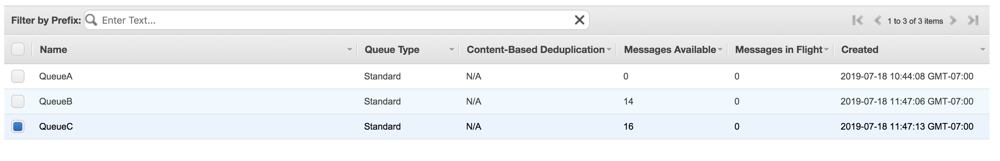

# Lab 38: SQS

## Overview
Creating a few Message Queues and Broadcasters and wiring them through code.

## Feature Tasks
Create 3 Standard Queues 
 - QueueA 
 - QueueB 
 - QueueC 

Queue Publisher 
 - Sends a message to a queue, using its ARN or URL
Queue Client
 - Receives messages from a Queue (by ARN) and displays them

## Run in Local Machine
Setup the environmental variable QueueA, QueueB, QueueC with your SQS url.

## Test
  

